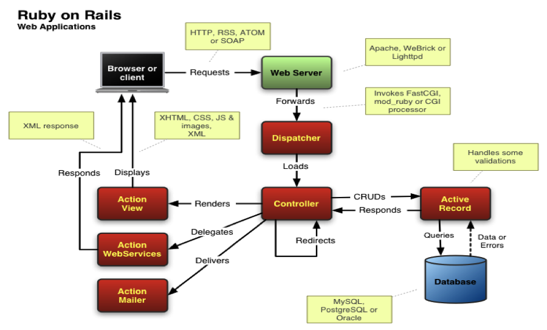

# T2A1-A  Workbook

# Anon Jaloenklung

## Q1
Rails is an open-source web application framework in Ruby. Rails' principle is "Don't Repeat Yourself" (DRY), which is what is done and will not repeat the behaviour. The format of the program will have a Model-View-Controller (MVC) architecture.



### The MVC architecture
MVC stands for Model, View, Controller. Which each part will work separately Have different duties and responsibilities.

### Model
It is responsible for correlating with the database. Each model is represented by a table of the database. For example, a Model named User will be associated with table Users in our database. The model is the one that we use, view, edit or delete the data in the database (retrieve, save, edit, delete). That is, the model acts as a personal manager, smoothing out the databases hierarchy. If we are going to do something with that database, we have to do it through the model. In addition, the model itself can also verify validations and associations between each model.

### View
In this section is a display that has been requested, there are many formats with writing basic HTML (.rhtml) inserted with a ruby script like PHP, JSP, ASP. In HTML, PDF, JSON, etc. It also interferes with the controller which is rendered via logic or any action that is sent from the controller. And the final result that appears will be called UI (User Interface) and sent to the user (client).

### Controller
It is the part that works first when a program is called from a web browser as the interface between the user and the program. By communicating with the database through the model and displaying the data through the view. The main focus of this section is the main processor of the program itself.

## Q2

### PostgreSQL


It is an object-oriented database management system (Object Relational Database Management or ORDBMS), or generally speaking, is a database that can help us to link one piece of data to another by working model. It can run on a variety of operating systems such as Linux, Unix and Windows. It includes support for JSON and can handle NoSQL as well as native xml support. It can use key-value compared to HSTORE and can also index JSON to access data.

### Performance
In terms of performance, it can be used in large-scale systems and has high read and write speeds, and it brings great performance when used in a commercial environment as well. Moreover, it works well as an OLTP / OLAP system when it is necessary to read or write and when detailed data is analyzed. It works well with applications that are Business Intelligence, suitable for Data Warehousing and data analysis applications requiring read and write speeds.

Pros :
- Resistant to use Designed to support the condition
- Reliability and stability
- Cross-Platform
- There are various applications such as Subquery, Complex Join.

Cons :
- Difficult to use than Database
- A financial transaction is required before using Firebase.
- If there is any form of misformed information It is also inserted Into the Database.
- It is less reliable than RDBMS.
- There are fewer support people than RDBMS.
- It's harder to find an expert than RDBMS.

## Q3
### Agile Project Management Methodology


It is a style of work, not a pattern or a process. It is not limited to being used for product development in the software line only. Agile places great importance on communicating with all stakeholders and constantly improving our products to meet our users' needs and results.

Most organizations tend to use a management system called Project Management, with the Project Manager managing projects and having a team to plan together from the budget, time, human resources and other elements from beginning to end of the project. In most cases, the working model of the Waterfall Process or work step by step. On the other hand, the agile concept has a different working style, because agile is a process that reduces both the step-by-step work and the documentation work. It will focus more on team communication in order to improve all aspects of it faster and then apply it to the sample user group (Target group) to test and use it and collect test results to evaluate again to improve.

Pattern difference between Waterfall Method and Agile Method


### Priority of agile development :
1. Tasks that need to be done immediately If this is not done, there may be major problems such as fixing errors that prevent users from using it and fix system crashes.
2. Tasks that require time to do, such as planning sprints, developing new features, expanding or upgrading existing systems.
3. Tasks that other people can do on their behalf, such as answering user inquiries.
4. Tasks that you shouldn't have or do in your free time, such as meetings that you don't need to attend.

When the focus is on part 2 development, it also decreases the work in Part 1 and the rest.

### The results obtained from making agile.
- Reduce misunderstandings.
- Reduce lag processes.
- Reduce duplication of work.

### Effective use of agile :
- Bring Feedback to improve the style of work.
- Useless plants and get the most value.
- Bring the errors that have occurred and improve them.
- Improve the original functionality and systems without reworking.
- I know what this is for, not just follow the guideline.

### Summary :

Agile is constantly improving work by listening to feedback from the actions we do and those who criticize the results because bringing feedback to improve the work process will make it work better and continue to develop.

## Q4

### Source Control :


Current Source Control, also known as Version Control is what developers are best known for because programming large programs is complicated. In order to create such a complex program, you need a wizard called Source Control that will perform more efficient work in writing the code. The developers can go back and check their own or other people's history of writing code by having a backup of the code on the remote to prevent loss and able to distinguish the version easily. Major tools for source There are currently two main controls: GIT and SVN, but GIT is very popular today, and the largest GIT website is Github currently owned by Microsoft. The principle of Git is to use Commit, which is like transcribing our code from time to time. Each time we commit is like a history of coding. That allows us to go back to that point again if an error occurred during the operation. Git can branch out from the Master to be able to fix a specific bug, or to rewrite it and clearly separate it from the old. When the work is completed, then merge the branch back to the Master. That's why it's possible to collaborate with other developers and also be able to separate it for their own. In the last part, we can bring the data back to the server. Therefore we have a backup and prevent data loss.

## Q5

### Software Testing :

It is the process of evaluating and improving the quality of the software to find errors and glitches, identifying ways to cause them and correcting them.

- Manual Testing : Is a test that is performed without using an Automated Tool or Script. It is a test that occurs from the testers by running the test according to the Test Plan, Test Case or Test Scenarios by the testers.

- Functional Testing : It tests and verifies that the software is fully functional and meets the requirements of the software. This section focuses on the functionality and the correctness of the software output.

- Blackbox Testing : Is a test that does not take into account the commands contained within the software. It is a test of the demand there is and looking at the resulting values expressed from the input to see if they are consistent. If the displayed results are consistent with the input. That is the correct operation of the black-box test. (Like a black box that can't see anything inside)

Here is an example of a software test:


- Test the functionality of the software that results from the testing of the developer (Preparation Testing).

- Design test cases to verify accuracy (Test Development and Verify).

- Comparison of performance and test results (Test Execution)

- Test Reporting from the tester (Test Reporting)

- Cooperate with other development teams and review the results of various tests (Test Result Analysis).

- Correction and improvement of errors from testers based on test results (Defect Fixing).

- Correct any errors that occur and run another test to check the results of corrections and close the test (Defect Retesting and Closure).

## Q6

###  Information System Security :

To protect and maintain information that may arise from the system or its unauthorized use, control and prevention of disclosure are required. Laws and Ethics in Information Technology have established a core concept of computer security called the "C.I.A Triangle".


Elements of the C.I.A Triangle :
- Confidentiality : It is a guarantee that only the rightful and authorized persons can access the information.
- Integrity : It is complete, accurate and free from any foreign material, so it is information that can be utilized correctly and completely.
- Availability : It is run smoothly on this system, it must be an authorized user only.
- Accuracy : Must always be error free and always meet the expectations of the user.
- Authenticity : Has been produced in legitimate sources and is not reproduced by unauthorized or unknown sources.
- Privacy : The information collected, retrieved and stored by the organization must be used solely for the purposes of the owner and acknowledgment, otherwise it will be an infringement of privacy.

An example of a project for a company that uses Information. Security in the form of C.I.A Triangle used. 

The control methods are as follows :
- Software Control
    - There are three methods :
        - Internal Program Control : Controls the right to access information stored in the system information.
        - Operating System Control : Control access to information in different parts of the computer system and distinguish it from other users.
        - Development Control : Controls from design and testing before use.

- Hardware Control : Access control and protection against malfunctions with the device itself.

- Policies : Establish work control policies that are consistent with business operations and the environment, with effects across the organization.

- Physical Control : There is computer control, especially staff, including a backup system regularly.

## Q7

###  Common Methods of Protecting Information and Data

The methods of protecting data to maintain data security are very important because threats directly impact the safety of life and property. The attack pattern is all based on vulnerabilities that lead to corruption.

It will enhance the security infrastructure of data protection as follows:

- Firewall : Install the system to have protection against basic intruders and set appropriate data access zones such as set the scope of work and services for authorized persons only.

- Anti-Virus : Install an Anti-Virus protection system to provide protection against foreign files from stealing data and to regularly update protection.


- SSL(Secure Socket Layer) : Data encryption technology to enhance the security of communication or transmission over the Internet between the server and the browser. It was like a small nest that was tied to Private. Key of the server to verify the identity and the validity of the transmission between them. It will make the data more secure and harder for hackers to extract because the data is tampered with in a coded form that makes it untranslatable.

- Web Server : Web system installation Server and configure parameters to suit the usage.

- Backup : Regular backups are fundamental and essential to data protection. In case of abnormal events, steal Or deleted important data, it can still be brought back if we ever backup data on a regular basis.

## Q8

###  Legal obligations are in relation to handling user data

The legal information to be applied to projects related to the handling of user information is referenced from APP (Australian Privacy Principles) 11 and 12, the two laws emphasize the protection and the right to access personal information and not grant others access to it. This information, as well as the entities that can be stored, whether directly or indirectly, must be limited and permitted by protecting the right of privacy from individuals to large entities. Key safety considerations are focused on forms of data misuse, interference, loss and unauthorized data, as well as the disclosure of information. To protect these data because personal information may cause crime in many forms, busy, it will be misused or harassed, such as Stealing money from credit cards, threats or harassment. If that's the case, the company might be ransom. This brings up a number of bargains, causing losses in many ways. 

Examples of data access violation: 

A very common form from the past to the present is Email and Web Phishing. It falsifies information by letting us fill in the information itself with a website format that is similar to the real website or a form that is similar to that of a company and There may be malware embedded in the system to access the company's archives. It is therefore often something that requires user training or set rules. To protect corporate data, such as not using external USB or opening e-mails and websites that are strange or unfamiliar.

## Q9

###  The structural aspects of the relational database model

The structure of a relational database is always an implementation of the relationship between the data in the relational model. Also called Table, the constructor of the Relation contains:


- Row : One row of data represents one item, each row of the Relation is called a Tuple, which is a row of data in a table. Each row of data is composed of several attributes or columns of information. The amount of data in each row in that table is called "Cardinality" and the number of attributes in that table is called "Degree".

- Column : Each column of a Relation has an attribute of each row called “Attribute”. Example of relation S for details of The suppliers consist of code, name, state and city, and that relation is composed of 5 tuples. Each tuple has 4 attributes.

    Inside the column contains: 

    - Domain : This defines the data values and data types for each of the possible attributes from the domain form. S # is a group of all suppliers code S1, S2, S3, S4 and S5. It then determines that the STATUS of the "S" table is required. The values are 10, 20 and 30 only or S # must have values S1, S2, S3, S4 and S5 only and "CITY" of all suppliers must be Bangkok, Phuket and Pattaya.
    - Primary key : It is an attribute, or a group of attributes, indicating that the data must be duplicated in each row of the table data.

## Q10

###  The integrity aspects of the relational database model

Typically, the amount of information in a database is large and may cause the information stored in each relationship to be inaccurate. Therefore, rules must be established to control the accuracy called "Integrity Rule". It is a number of limitations that are used to keep the information accurate.

Can be divided into two types :

- Database Specific Integrity Rule : Set to control the validity of a particular database, for example

    - Each employee ID must be a 5 digit number.
    - Each employee can belong to only one department.
    - The employee's salary amount must be greater than 0.

- General Integrity Rule : Control and maintain the relationships between the various parts of the information so that they are relevant and applicable to all databases.

    Divided into 3 rules:

    - Entity Integrity : It was stated that the Primary Key of any Base Relation should not have a Null value.

    - Referential Integrity : The database must not have a relation containing a foreign key that is independent of the candidate key in any other relation.

    - Domain Integrity : Make sure the entered information is complete and correct following the same regulations for both the domain and the column.

Additional Information :

- Key : It is the specified attribute and allows the values of other attributes.
- Super Key : The attribute information in each tuple in a relation has a unique value.
- Candidate Key : The smallest super key in the relation tuple has a unique value.
- Primary Key : Selection of candidate key smallest and most commonly used key is the primary key to verify the information.
- Foreign Key : An attribute in a relation that references an attribute that acts as a candidate key of another relation.
- Null : It is the configuration of the data that cannot be determined.

## Q11

###  The manipulative aspects of the relational database model

A type of SQL statement that is used to manipulate data stored in a database table. In which data management, there are main commands that are Insert, Update, Select and Delete.

- SELECT statement : The command to retrieve the information from the database is displayed as the user wants and to retrieve the information can use a number of commands.

    - Unconditional
    ```
    SELECT column_name
    FROM table_name
    ```
    - Conditional (SELECT ... WHERE ...)
    ```
    SELECT column_name
    FROM table_name
    WHERE condition;
    ```
    - Using functions
    ```
    SELECT funtion column_name
    FROM table_name
    ```

    An example of a special command is as follows.

    - COUNT is used to count the number of rows of columns. How many rows of data in that column

    - SUM is used to sum the numeric data of a column.

    - AVG is used to average the numerical data of a column.

    - MAX is used to find the largest numerical value of a column.

    - MIN is used to find the smallest numeric value of a column.

- INSERT statement : The command to add data to the table.
    ```
    INSERT INTO table_name
    VALUES ( 'value_1', 'value_2', ...);
    ```

- UPDATE statement : A command to update and modify data in a data table, which can be combined with a WHERE clause to create correction conditions.

    ```
    UPDATE table_name
    SET field_name = value_1
    WHERE  condition
    ```

- DELETE statement : The command deletes data rows from the table, this deletes the specific data that meets the required conditions.

    ```
    DELETE FROM 
    WHERE table_name
    ```

## Q12

###  Lazada App


- A : List of software :

    - Java : It is a kind of programming support language that is suitable for the development of complex systems. It is less complex than C ++. It also offers free IDEs, application servers, and libraries.

    - JavaScript : It is a kind of computer language that is different from Java. It is intended to manage the behavior of the website. In addition, there are also many other libraries that can be used as an extension of management.

    - Zepto : One of the most compact and simple JavaScript Library to write and get the most from an API.

    - Bootstrap : It is a Frontend Framework that allows us to easily build the web according to the way we want and have a grid system. That helps with a layout that supports responsive and ready-made components to use.

    - GlobalSign : A type of SSL Certificates that establish security standards in electronic transactions where sensitive information is received and transmitted.

    - Google Analytics : A Google service that gives website owners real-time historical information. Moreover, data can be analyzed in various fields.

    - Google Tag Manager : It helps you to quickly update your code and keep track of relevant codes, also known as tags, based on your website or on your device.

    - Open Graph : The link between our products and Facebook.

- B : Describe the hardware :

    - Website Server : Lazada's HTTP web server is Tengine, created by Alibaba affiliate Taobao.

    - Web Hosting/ Data Center/ DNS Server/ Email Server : Lazada's Web Hosting, Data Center, DNS Server and Email Server are all directly affiliated with Alibaba as Lazada is a subsidiary. Moreover, Alibaba has covered the Cloud. Servers are almost all over Asia, including other areas such as Hong Kong, Japan, Singapore, Australia, Dubai, Germany and the United States.

- C : Describe interaction of technologies :

    - Since Lazada is targeting Asian customers with high online shopping habits, it is important to design the web page and the app to be user-friendly. Choosing to use Java that is designed to be highly secure, combined with JavaScript with a wide selection of libraries. Thus making it possible to reach the use of the target audience Including picking up tools like Google Analytics to help analyze audience behaviour. Open Graph that makes various information of the target audience bounce to the Facebook Feed page. As a result, Lazada's web and apps are used frequently in Asia.

- D : Data Structured :

    - Lazada collects information between buyers and sellers in terms of use. Technical information and user profile information will be used to improve communication and marketing information. For example, what a user is searching for, what kind of product they want, and what kind of product they have bought. Including commenting, sharing or liking through various social media. The format of Lazada will be Two-sided. market, which acts as a mediator between sellers and buyers, Lazada is a platform that will attract the two target groups together.

- E : Entities tracked by the app :

    - CustomerUser : [Username, Contact, Address, Email]

    - ProductItem : [Image, Product Name, Description, Price, Promotion]

    - ItemOrder : [Order Name]

    - OrderDetail 

    - AddItem

    - ShoppingCart : [ Quality, Date ]

    - ShippingInfo : [Shipping Type, Shipping Cost, Shipping Region]

- F : Relationships Entities :

```
    - [CustomerUser] has many [OrderDetail]
    - [OrderDetail] has one [CustomerUser]
    - [ItemOrder] has many [OrderDetail]
    - [OrderDetail] has one [ItemOrder]
    - [ItemOrder] has one [ShippingInfo]
    - [ShippingInfo] has one [ItemOrder]
    - [ItemOrder] has one [ShoppingCart]
    - [ShoppingCart] has one [ItemOrder]
    - [AddItem] has many [ShoppingCart]
    - [ProductItem] has many [AddItem]
    - [AddItem] has one [ProductItem]
    - [AddItem] has one [ShoppingCart]
```

- G : Entity Relationship Diagram :


# Reference

Dave Bourgeois, D. T. B., n.d. [Online] 
Available at: https://bus206.pressbooks.com/chapter/chapter-6-information-systems-security/

Gehman, C., n.d. What Is Source Control?. [Online] 
Available at: https://www.perforce.com/blog/vcs/what-source-control

McHale, B., n.d. Agile Project Management. [Online] 
Available at: https://www.projectcentral.com/blog/agile-project-management/

Mejia, A., n.d. Ruby on Rails Architectural Design. [Online] 
Available at: https://adrianmejia.com/ruby-on-rails-architectural-design/

Website, n.d. AGILE IMPLEMENTATION METHODOLOGY. [Online] 
Available at: https://www.cosmoconsult.com/business-and-it-consulting/implementation-methodologies-and-implementation-consulting/agile-implementation-methodology/

Website, n.d. Essential Data Protection Methods. [Online] 
Available at: https://gdprinformer.com/gdpr-articles/6-essential-data-protection-methods

Website, n.d. Overview of web technologies used by Lazada. [Online] 
Available at: https://w3techs.com/sites/info/lazada.co.th

Website, n.d. Postgresql. [Online] 
Available at: https://www.postgresql.org/about/

Website, n.d. Relational model. [Online] 
Available at: https://en.wikipedia.org/wiki/Relational_model

Website, n.d. Software Testing. [Online] 
Available at: https://www.tutorialspoint.com/software_testing/software_testing_quick_guide.htm
